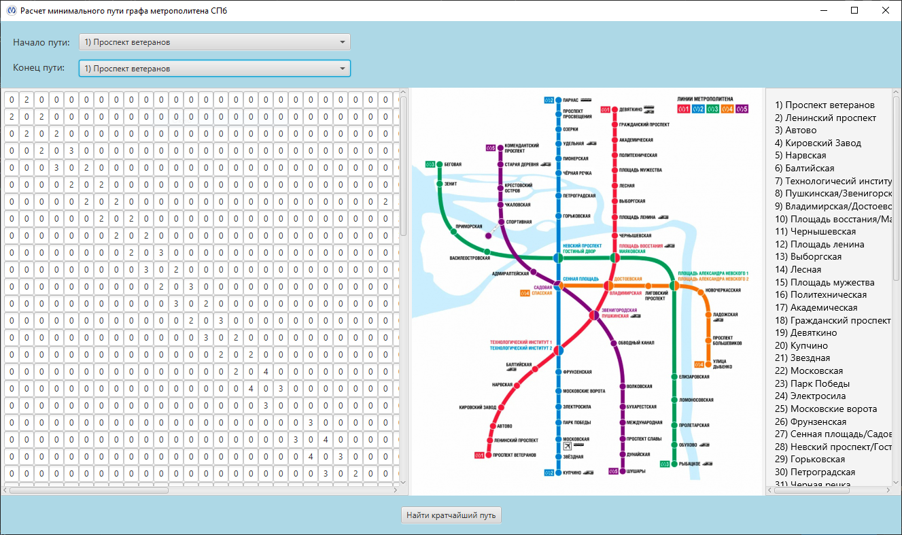
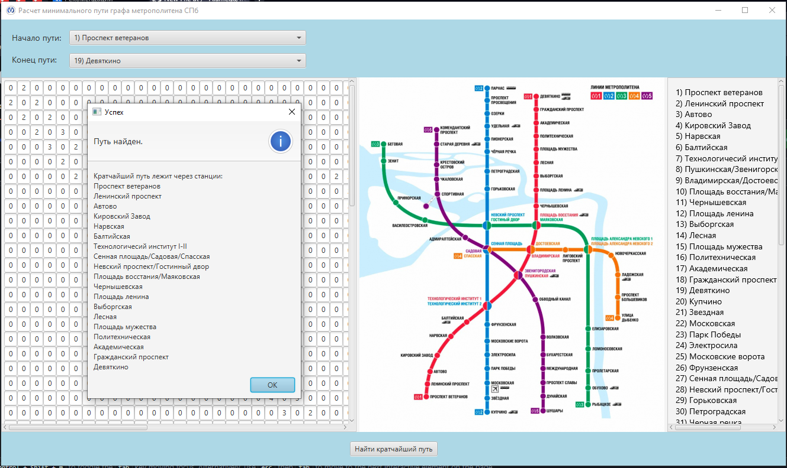

## Приложение для поиска кратчайшего пути с использованием матрицы смежности и алгоритма Дейкстры на примере метрополитена.

Сверху поля выбора начала и конца пути, слева матрица смежности графа метро СПб, в центре схема и справа список всех станций и номеров их столбца/строки в матрице.

После выбора станций и нажатия кнопки "Найти кратчайший путь" будет выведен список всех станций найденного пути согласно матрице смежности.

